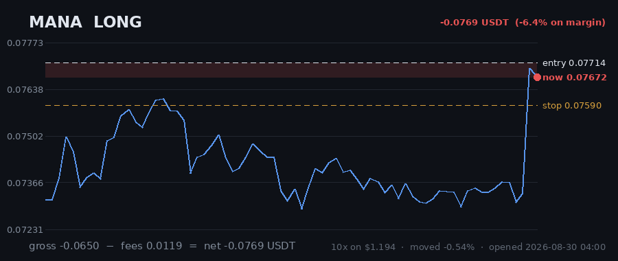

# Hourly Trading Bot

**Updated 2026-08-30 04:07 UTC** &nbsp;·&nbsp; refreshes itself every hour

Paper money. $20 simulated, real Gate.io prices, no API keys — it cannot place a real order.

## Money

| | |
|---|---|
| **Equity now** | **$19.3622** 🔴 -3.19% |
| Settled balance | $19.4600 (-2.70%) |
| Unrealised (open trades) | 🔴 -0.0978 |
| Started with | $20.0000 |
| Finished trades | 3 |
| Open now | 7 |
| Win rate | 0% (0/3) |

## Open right now

| Coin | Direction | Entry | Price now | Moved | P&L | on margin | Room to stop |
|---|---|---|---|---|---|---|---|
| **FIL** | SHORT 🔻 | 0.6813 | 0.6772 | -0.60% | 🟢 +0.0360 | +5.1% | 3.34% |
| **SAND** | SHORT 🔻 | 0.03898 | 0.03874 | -0.62% | 🔴 -0.0012 | -0.2% | 3.36% |
| **AXS** | SHORT 🔻 | 0.895 | 0.9033 | +0.93% | 🔴 -0.0760 | -9.9% | 1.54% |
| **EGLD** | LONG 🔺 | 3.622 | 3.687 | +1.79% | 🟢 +0.1403 | +16.8% | 3.96% |
| **CRV** | SHORT 🔻 | 0.2973 | 0.3003 | +1.01% | 🔴 -0.1061 | -10.5% | 0.87% |
| **UNI** | LONG 🔺 | 4.879 | 4.87 | -0.18% | 🔴 -0.0139 | -2.8% | 2.65% |
| **MANA** | LONG 🔺 | 0.07714 | 0.07672 | -0.54% | 🔴 -0.0769 | -6.4% | 1.07% |
| | | | | **total** | **-0.0978** | | |

> 3 long / 4 short · gross exposure **293% of equity**.

## What it is waiting for

**3 coin(s) ready to fire right now.** Scanned 47 coins.

| Coin | Would be | Needs | Status |
|---|---|---|---|
| UNI | LONG | 0.00% | **READY** |
| MANA | LONG | 0.00% | **READY** |
| EGLD | LONG | 0.00% | **READY** |
| DOT | SHORT | 0.84% | needs 0.8% move; volume below average |
| ADA | SHORT | 0.85% | needs 0.8% move |
| BCH | SHORT | 1.12% | needs 1.1% move; volume below average |
| RVN | SHORT | 1.18% | needs 1.2% move; trend too weak (ADX 14/20) |
| SNX | SHORT | 1.29% | needs 1.3% move; volume below average |
| FIL | SHORT | 1.57% | needs 1.6% move |
| ANKR | LONG | 1.58% | needs 1.6% move; trend too weak (ADX 16/20) |

A trade needs **all four** of: price breaking its 3-day range, the trend filter agreeing, enough momentum (ADX over 20), and above-average volume. A coin at 0.00% that still has not traded is being held back by one of the other three — the table says which.

## Results

### Last 15 finished trades

| Coin | Direction | Result | Why it closed | When |
|---|---|---|---|---|
| ICP | LONG | 🔴 -0.2062 (-24.6%) | stop_loss | 2026-08-30 01:13 |
| BCH | SHORT | 🔴 -0.1922 (-19.8%) | trailing_stop_loss | 2026-08-29 20:06 |
| UNI | LONG | 🔴 -0.1416 (-30.3%) | trailing_stop_loss | 2026-08-28 10:07 |

---

### How it works

Watches 47 coins every hour. Goes long when one breaks above its 3-day high, short when one breaks below its 3-day low — but only if the trend, momentum and volume all agree.

Every trade gets a stop-loss. Winners are left to run on a trailing stop rather than closed at a fixed target. It risks 1% of the account per trade and never holds more than 5 positions on the same side, so one bad day cannot end it.

**It loses more trades than it wins** — about 2-3 winners in 10, by design, with the winners much larger. Backtested on 2024-2026 it lost money. This is running on live prices with fake money to see what it actually does.
