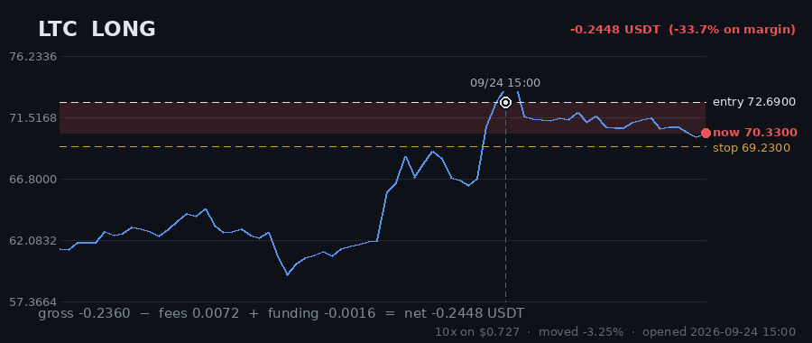
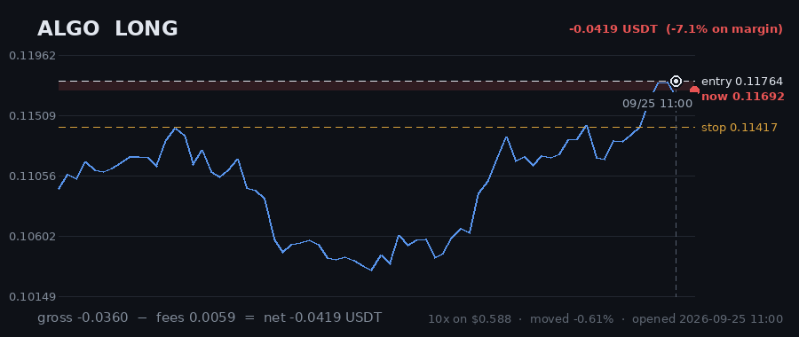

# Hourly Trading Bot

**Updated 2026-09-25 13:07 UTC** &nbsp;·&nbsp; refreshes itself every hour

Paper money. $20 simulated, real Gate.io prices, no API keys — it cannot place a real order.

## Money

| | |
|---|---|
| **Equity now** | **$20.9570** 🟢 +4.78% |
| Settled balance | $20.3571 (+1.79%) |
| Unrealised (open trades) | 🟢 +0.5998 |
| Started with | $20.0000 |
| Finished trades | 48 |
| Open now | 5 |
| Win rate | 35% (17/48) |

## Open right now

| Coin | Direction | Entry | Price now | Moved | P&L | on margin | Room to stop |
|---|---|---|---|---|---|---|---|
| **LTC** | LONG 🔺 | 72.69 | 70.33 | -3.25% | 🔴 -0.2448 | -33.7% | 1.56% |
| **LINK** | LONG 🔺 | 13.424 | 14.077 | +4.86% | 🟢 +0.6448 | +48.0% | 7.60% |
| **MANA** | LONG 🔺 | 0.09099 | 0.09152 | +0.58% | 🟢 +0.0342 | +4.7% | 3.33% |
| **NEAR** | LONG 🔺 | 4.9082 | 5.1206 | +4.33% | 🟢 +0.2074 | +34.1% | 10.02% |
| **ALGO** | LONG 🔺 | 0.11764 | 0.11692 | -0.61% | 🔴 -0.0419 | -7.1% | 2.35% |
| | | | | **total** | **+0.5998** | | |

> ⚠️ **All 5 positions are long.** That is one bet on the same market direction, placed 5 times — these coins move together, so they will win together and lose together. Gross exposure is **190% of equity**.

## What it is waiting for

**0 coin(s) ready to fire right now.** Scanned 47 coins.

| Coin | Would be | Needs | Status |
|---|---|---|---|
| NEAR | LONG | 0.15% | needs 0.2% move |
| KSM | LONG | 0.27% | needs 0.3% move |
| QTUM | LONG | 0.67% | needs 0.7% move |
| MANA | LONG | 0.71% | needs 0.7% move |
| IOTA | LONG | 0.86% | needs 0.9% move |
| COMP | LONG | 0.91% | needs 0.9% move; volume below average |
| LINK | LONG | 0.92% | needs 0.9% move |
| SKL | LONG | 1.08% | needs 1.1% move |
| SOL | LONG | 1.28% | needs 1.3% move |
| ONT | LONG | 1.77% | needs 1.8% move |

A trade needs **all four** of: price breaking its 3-day range, the trend filter agreeing, enough momentum (ADX over 20), and above-average volume. A coin at 0.00% that still has not traded is being held back by one of the other three — the table says which.

## Results

### Last 15 finished trades

| Coin | Direction | Result | Why it closed | When |
|---|---|---|---|---|
| NEAR | LONG | 🔴 -0.2758 (-51.5%) | stop_loss | 2026-09-23 14:13 |
| HBAR | LONG | 🔴 -0.1833 (-37.7%) | stop_loss | 2026-09-22 10:24 |
| GRT | LONG | 🟢 +0.1471 (+23.7%) | force_exit | 2026-09-21 03:14 |
| ALGO | LONG | 🔴 -0.1920 (-42.4%) | stop_loss | 2026-09-20 21:11 |
| HBAR | LONG | 🔴 -0.2020 (-32.9%) | stop_loss | 2026-09-20 19:21 |
| DASH | LONG | 🔴 -0.1733 (-45.7%) | stop_loss | 2026-09-19 05:58 |
| CELO | LONG | 🟢 +0.1347 (+11.6%) | force_exit | 2026-09-19 09:28 |
| ADA | LONG | 🔴 -0.0111 (-1.6%) | force_exit | 2026-09-19 09:28 |
| FIL | LONG | 🟢 +0.3452 (+56.0%) | force_exit | 2026-09-19 09:28 |
| AVAX | LONG | 🟢 +0.8187 (+99.7%) | force_exit | 2026-09-19 09:28 |
| BAND | SHORT | 🔴 -0.2433 (-17.3%) | stop_loss | 2026-09-16 21:01 |
| AAVE | SHORT | 🔴 -0.1684 (-27.9%) | trailing_stop_loss | 2026-09-17 12:58 |
| CRV | SHORT | 🔴 -0.2163 (-39.5%) | stop_loss | 2026-09-17 17:07 |
| DOT | SHORT | 🔴 -0.2029 (-30.4%) | stop_loss | 2026-09-16 12:22 |
| BTC | SHORT | 🔴 -0.1855 (-12.2%) | stop_loss | 2026-09-15 17:33 |

---

### How it works

Watches 47 coins every hour. Goes long when one breaks above its 3-day high, short when one breaks below its 3-day low — but only if the trend, momentum and volume all agree.

Every trade gets a stop-loss. Winners are left to run on a trailing stop rather than closed at a fixed target. It risks 1% of the account per trade and never holds more than 5 positions on the same side, so one bad day cannot end it.

**It loses more trades than it wins** — about 2-3 winners in 10, by design, with the winners much larger. Backtested on 2024-2026 it lost money. This is running on live prices with fake money to see what it actually does.
