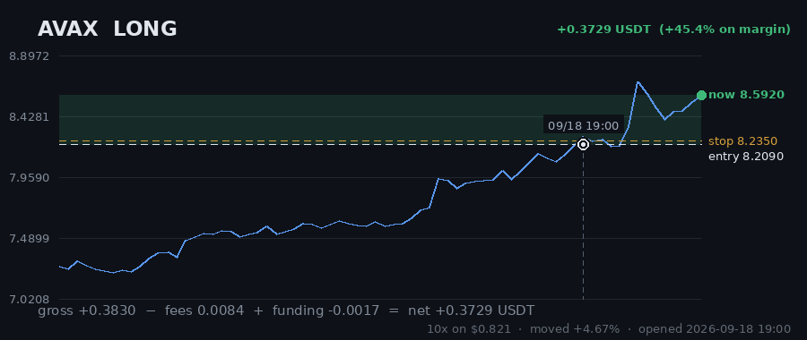
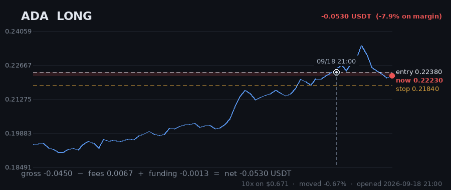
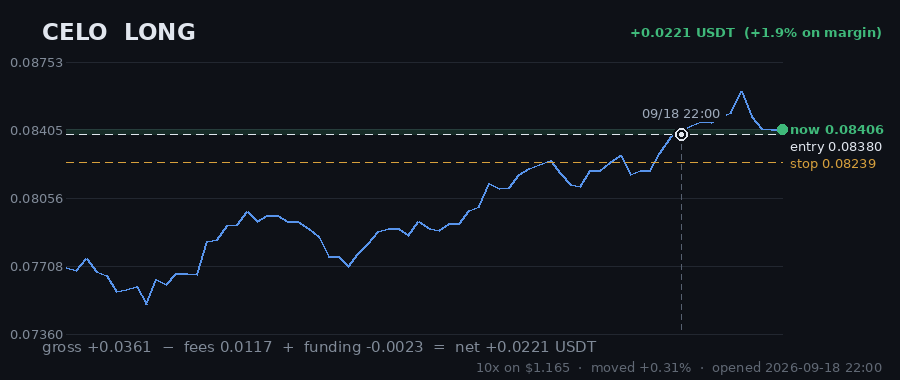

# Hourly Trading Bot

**Updated 2026-09-19 08:07 UTC** &nbsp;·&nbsp; refreshes itself every hour

Paper money. $20 simulated, real Gate.io prices, no API keys — it cannot place a real order.

## Money

| | |
|---|---|
| **Equity now** | **$20.4399** 🟢 +2.20% |
| Settled balance | $19.7755 (-1.12%) |
| Unrealised (open trades) | 🟢 +0.6644 |
| Started with | $20.0000 |
| Finished trades | 39 |
| Open now | 4 |
| Win rate | 33% (13/39) |

## Open right now

| Coin | Direction | Entry | Price now | Moved | P&L | on margin | Room to stop |
|---|---|---|---|---|---|---|---|
| **AVAX** | LONG 🔺 | 8.209 | 8.592 | +4.67% | 🟢 +0.3729 | +45.4% | 4.16% |
| **FIL** | LONG 🔺 | 0.9162 | 0.9653 | +5.36% | 🟢 +0.3224 | +52.4% | 5.88% |
| **ADA** | LONG 🔺 | 0.2238 | 0.2223 | -0.67% | 🔴 -0.0530 | -7.9% | 1.75% |
| **CELO** | LONG 🔺 | 0.0838 | 0.08406 | +0.31% | 🟢 +0.0221 | +1.9% | 1.99% |
| | | | | **total** | **+0.6644** | | |

> ⚠️ **All 4 positions are long.** That is one bet on the same market direction, placed 4 times — these coins move together, so they will win together and lose together. Gross exposure is **166% of equity**.

## What it is waiting for

**0 coin(s) ready to fire right now.** Scanned 47 coins.

| Coin | Would be | Needs | Status |
|---|---|---|---|
| ETH | LONG | 0.78% | needs 0.8% move; volume below average |
| BTC | LONG | 0.86% | needs 0.9% move; volume below average |
| BAT | LONG | 1.09% | needs 1.1% move; volume below average |
| BNB | LONG | 1.14% | needs 1.1% move; volume below average |
| CHZ | LONG | 1.14% | needs 1.1% move; volume below average |
| LINK | LONG | 1.57% | needs 1.6% move |
| ICP | LONG | 2.00% | needs 2.0% move |
| BAND | LONG | 2.02% | needs 2.0% move; volume below average |
| ETC | LONG | 2.14% | needs 2.1% move; volume below average |
| ENJ | LONG | 2.15% | needs 2.1% move; volume below average |

A trade needs **all four** of: price breaking its 3-day range, the trend filter agreeing, enough momentum (ADX over 20), and above-average volume. A coin at 0.00% that still has not traded is being held back by one of the other three — the table says which.

## Results

### Last 15 finished trades

| Coin | Direction | Result | Why it closed | When |
|---|---|---|---|---|
| DASH | LONG | 🔴 -0.1733 (-45.7%) | stop_loss | 2026-09-19 05:58 |
| BAND | SHORT | 🔴 -0.2433 (-17.3%) | stop_loss | 2026-09-16 21:01 |
| AAVE | SHORT | 🔴 -0.1684 (-27.9%) | trailing_stop_loss | 2026-09-17 12:58 |
| CRV | SHORT | 🔴 -0.2163 (-39.5%) | stop_loss | 2026-09-17 17:07 |
| DOT | SHORT | 🔴 -0.2029 (-30.4%) | stop_loss | 2026-09-16 12:22 |
| BTC | SHORT | 🔴 -0.1855 (-12.2%) | stop_loss | 2026-09-15 17:33 |
| ICP | SHORT | 🔴 -0.2177 (-28.4%) | stop_loss | 2026-09-17 18:20 |
| RVN | SHORT | 🔴 -0.2229 (-28.0%) | trailing_stop_loss | 2026-09-17 06:14 |
| LINK | SHORT | 🔴 -0.1837 (-16.5%) | trailing_stop_loss | 2026-09-14 02:10 |
| QTUM | LONG | 🔴 -0.2246 (-20.2%) | stop_loss | 2026-09-12 16:06 |
| BCH | SHORT | 🟢 +0.4651 (+63.3%) | force_exit | 2026-09-10 13:25 |
| MANA | SHORT | 🔴 -0.2237 (-22.1%) | trailing_stop_loss | 2026-09-11 12:37 |
| EGLD | LONG | 🔴 -0.2262 (-42.6%) | stop_loss | 2026-09-10 11:05 |
| CRV | SHORT | 🔴 -0.2182 (-34.4%) | trailing_stop_loss | 2026-09-10 14:26 |
| AAVE | SHORT | 🟢 +0.2033 (+23.1%) | force_exit | 2026-09-10 11:07 |

---

### How it works

Watches 47 coins every hour. Goes long when one breaks above its 3-day high, short when one breaks below its 3-day low — but only if the trend, momentum and volume all agree.

Every trade gets a stop-loss. Winners are left to run on a trailing stop rather than closed at a fixed target. It risks 1% of the account per trade and never holds more than 5 positions on the same side, so one bad day cannot end it.

**It loses more trades than it wins** — about 2-3 winners in 10, by design, with the winners much larger. Backtested on 2024-2026 it lost money. This is running on live prices with fake money to see what it actually does.
