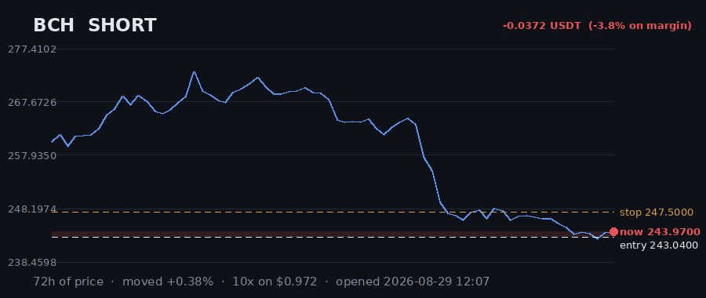

# Hourly Trading Bot

**Updated 2026-08-29 13:12 UTC** &nbsp;·&nbsp; refreshes itself every hour

Paper money. $20 simulated, real Gate.io prices, no API keys — it cannot place a real order.

## Money

| | |
|---|---|
| **Equity now** | **$19.9098** 🔴 -0.45% |
| Settled balance | $19.8584 (-0.71%) |
| Unrealised (open trades) | 🟢 +0.0514 |
| Started with | $20.0000 |
| Finished trades | 1 |
| Open now | 4 |
| Win rate | 0% (0/1) |

## Open right now

| Coin | Direction | Entry | Price now | Moved | P&L | on margin | Room to stop |
|---|---|---|---|---|---|---|---|
| **FIL** | SHORT 🔻 | 0.6813 | 0.6782 | -0.46% | 🟢 +0.0323 | +4.6% | 3.18% |
| **SAND** | SHORT 🔻 | 0.03898 | 0.03882 | -0.41% | 🟢 +0.0288 | +4.1% | 3.14% |
| **AXS** | SHORT 🔻 | 0.895 | 0.8918 | -0.36% | 🟢 +0.0275 | +3.6% | 2.85% |
| **BCH** | SHORT 🔻 | 243.04 | 243.97 | +0.38% | 🔴 -0.0372 | -3.8% | 1.45% |
| | | | | **total** | **+0.0514** | | |

> ⚠️ **All 4 positions are short.** That is one bet on the same market direction, placed 4 times — these coins move together, so they will win together and lose together. Gross exposure is **159% of equity**.

## What it is waiting for

**0 coin(s) ready to fire right now.** Scanned 47 coins.

| Coin | Would be | Needs | Status |
|---|---|---|---|
| IOTA | SHORT | 0.00% | volume below average |
| SNX | SHORT | 0.33% | needs 0.3% move; volume below average |
| ADA | SHORT | 0.35% | needs 0.4% move; volume below average |
| ALGO | SHORT | 0.54% | needs 0.5% move |
| DOT | SHORT | 0.96% | needs 1.0% move; volume below average |
| NEAR | SHORT | 1.14% | needs 1.1% move; volume below average |
| ENJ | SHORT | 1.40% | needs 1.4% move; volume below average |
| RVN | SHORT | 1.47% | needs 1.5% move; trend too weak (ADX 13/20) |
| AXS | SHORT | 1.60% | needs 1.6% move; volume below average |
| SAND | SHORT | 1.62% | needs 1.6% move |

A trade needs **all four** of: price breaking its 3-day range, the trend filter agreeing, enough momentum (ADX over 20), and above-average volume. A coin at 0.00% that still has not traded is being held back by one of the other three — the table says which.

## Results

### Last 15 finished trades

| Coin | Direction | Result | Why it closed | When |
|---|---|---|---|---|
| UNI | LONG | 🔴 -0.1416 (-30.3%) | trailing_stop_loss | 2026-08-28 10:07 |

---

### How it works

Watches 47 coins every hour. Goes long when one breaks above its 3-day high, short when one breaks below its 3-day low — but only if the trend, momentum and volume all agree.

Every trade gets a stop-loss. Winners are left to run on a trailing stop rather than closed at a fixed target. It risks 1% of the account per trade and never holds more than 5 positions on the same side, so one bad day cannot end it.

**It loses more trades than it wins** — about 2-3 winners in 10, by design, with the winners much larger. Backtested on 2024-2026 it lost money. This is running on live prices with fake money to see what it actually does.
