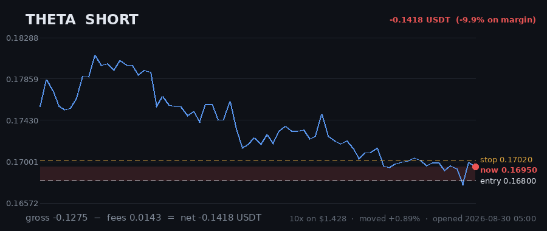

# Hourly Trading Bot

**Updated 2026-08-30 06:10 UTC** &nbsp;·&nbsp; refreshes itself every hour

Paper money. $20 simulated, real Gate.io prices, no API keys — it cannot place a real order.

## Money

| | |
|---|---|
| **Equity now** | **$19.3333** 🔴 -3.33% |
| Settled balance | $19.2469 (-3.77%) |
| Unrealised (open trades) | 🟢 +0.0863 |
| Started with | $20.0000 |
| Finished trades | 4 |
| Open now | 8 |
| Win rate | 0% (0/4) |

## Open right now

| Coin | Direction | Entry | Price now | Moved | P&L | on margin | Room to stop |
|---|---|---|---|---|---|---|---|
| **FIL** | SHORT 🔻 | 0.6813 | 0.6782 | -0.46% | 🟢 +0.0256 | +3.6% | 3.18% |
| **SAND** | SHORT 🔻 | 0.03898 | 0.03848 | -1.28% | 🟢 +0.0456 | +6.5% | 4.05% |
| **AXS** | SHORT 🔻 | 0.895 | 0.9051 | +1.13% | 🔴 -0.0915 | -11.9% | 1.34% |
| **EGLD** | LONG 🔺 | 3.622 | 3.784 | +4.47% | 🟢 +0.3632 | +43.6% | 6.18% |
| **CRV** | SHORT 🔻 | 0.2973 | 0.2996 | +0.77% | 🔴 -0.0823 | -8.1% | 1.10% |
| **UNI** | LONG 🔺 | 4.879 | 4.875 | -0.08% | 🔴 -0.0089 | -1.8% | 2.75% |
| **THETA** | SHORT 🔻 | 0.168 | 0.1695 | +0.89% | 🔴 -0.1418 | -9.9% | 0.41% |
| **KSM** | LONG 🔺 | 3.636 | 3.632 | -0.11% | 🔴 -0.0237 | -2.1% | 1.51% |
| | | | | **total** | **+0.0863** | | |

> 3 long / 5 short · gross exposure **367% of equity**.

## What it is waiting for

**2 coin(s) ready to fire right now.** Scanned 47 coins.

| Coin | Would be | Needs | Status |
|---|---|---|---|
| KSM | LONG | 0.00% | **READY** |
| EGLD | LONG | 0.00% | **READY** |
| UNI | LONG | 0.84% | needs 0.8% move |
| ADA | SHORT | 1.00% | needs 1.0% move; volume below average |
| BCH | SHORT | 1.06% | needs 1.1% move; volume below average |
| DOT | SHORT | 1.31% | needs 1.3% move; volume below average |
| THETA | SHORT | 1.41% | needs 1.4% move |
| MANA | LONG | 1.52% | needs 1.5% move |
| SNX | SHORT | 1.53% | needs 1.5% move; volume below average |
| HBAR | SHORT | 1.56% | needs 1.6% move; trend too weak (ADX 18/20) |

A trade needs **all four** of: price breaking its 3-day range, the trend filter agreeing, enough momentum (ADX over 20), and above-average volume. A coin at 0.00% that still has not traded is being held back by one of the other three — the table says which.

## Results

### Last 15 finished trades

| Coin | Direction | Result | Why it closed | When |
|---|---|---|---|---|
| MANA | LONG | 🔴 -0.2131 (-17.8%) | stop_loss | 2026-08-30 04:42 |
| ICP | LONG | 🔴 -0.2062 (-24.6%) | stop_loss | 2026-08-30 01:13 |
| BCH | SHORT | 🔴 -0.1922 (-19.8%) | trailing_stop_loss | 2026-08-29 20:06 |
| UNI | LONG | 🔴 -0.1416 (-30.3%) | trailing_stop_loss | 2026-08-28 10:07 |

---

### How it works

Watches 47 coins every hour. Goes long when one breaks above its 3-day high, short when one breaks below its 3-day low — but only if the trend, momentum and volume all agree.

Every trade gets a stop-loss. Winners are left to run on a trailing stop rather than closed at a fixed target. It risks 1% of the account per trade and never holds more than 5 positions on the same side, so one bad day cannot end it.

**It loses more trades than it wins** — about 2-3 winners in 10, by design, with the winners much larger. Backtested on 2024-2026 it lost money. This is running on live prices with fake money to see what it actually does.
