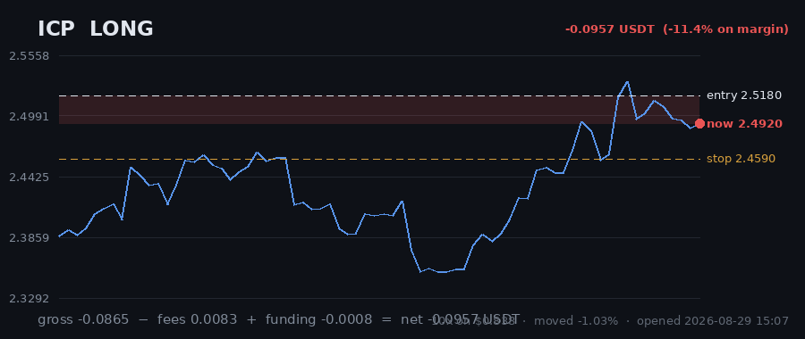

# Hourly Trading Bot

**Updated 2026-08-29 23:07 UTC** &nbsp;·&nbsp; refreshes itself every hour

Paper money. $20 simulated, real Gate.io prices, no API keys — it cannot place a real order.

## Money

| | |
|---|---|
| **Equity now** | **$19.4852** 🔴 -2.57% |
| Settled balance | $19.6663 (-1.67%) |
| Unrealised (open trades) | 🔴 -0.1810 |
| Started with | $20.0000 |
| Finished trades | 2 |
| Open now | 5 |
| Win rate | 0% (0/2) |

## Open right now

| Coin | Direction | Entry | Price now | Moved | P&L | on margin | Room to stop |
|---|---|---|---|---|---|---|---|
| **FIL** | SHORT 🔻 | 0.6813 | 0.682 | +0.10% | 🔴 -0.0143 | -2.0% | 2.61% |
| **SAND** | SHORT 🔻 | 0.03898 | 0.03861 | -0.95% | 🟢 +0.0371 | +5.3% | 3.70% |
| **AXS** | SHORT 🔻 | 0.895 | 0.9001 | +0.57% | 🔴 -0.0493 | -6.4% | 1.90% |
| **ICP** | LONG 🔺 | 2.518 | 2.492 | -1.03% | 🔴 -0.0957 | -11.4% | 1.32% |
| **EGLD** | LONG 🔺 | 3.622 | 3.6 | -0.61% | 🔴 -0.0589 | -7.1% | 1.64% |
| | | | | **total** | **-0.1810** | | |

> 2 long / 3 short · gross exposure **196% of equity**.

## What it is waiting for

**0 coin(s) ready to fire right now.** Scanned 47 coins.

| Coin | Would be | Needs | Status |
|---|---|---|---|
| SNX | SHORT | 0.67% | needs 0.7% move; volume below average |
| ADA | SHORT | 1.09% | needs 1.1% move; volume below average |
| EGLD | LONG | 1.20% | needs 1.2% move; volume below average |
| BCH | SHORT | 1.72% | needs 1.7% move; volume below average |
| DOT | SHORT | 1.77% | needs 1.8% move; volume below average |
| ENJ | SHORT | 1.91% | needs 1.9% move; volume below average |
| FIL | SHORT | 2.06% | needs 2.1% move; volume below average |
| ICP | LONG | 2.21% | needs 2.2% move; volume below average |
| RVN | SHORT | 2.23% | needs 2.2% move; trend too weak (ADX 13/20) |
| SAND | SHORT | 2.25% | needs 2.3% move; volume below average |

A trade needs **all four** of: price breaking its 3-day range, the trend filter agreeing, enough momentum (ADX over 20), and above-average volume. A coin at 0.00% that still has not traded is being held back by one of the other three — the table says which.

## Results

### Last 15 finished trades

| Coin | Direction | Result | Why it closed | When |
|---|---|---|---|---|
| BCH | SHORT | 🔴 -0.1922 (-19.8%) | trailing_stop_loss | 2026-08-29 20:06 |
| UNI | LONG | 🔴 -0.1416 (-30.3%) | trailing_stop_loss | 2026-08-28 10:07 |

---

### How it works

Watches 47 coins every hour. Goes long when one breaks above its 3-day high, short when one breaks below its 3-day low — but only if the trend, momentum and volume all agree.

Every trade gets a stop-loss. Winners are left to run on a trailing stop rather than closed at a fixed target. It risks 1% of the account per trade and never holds more than 5 positions on the same side, so one bad day cannot end it.

**It loses more trades than it wins** — about 2-3 winners in 10, by design, with the winners much larger. Backtested on 2024-2026 it lost money. This is running on live prices with fake money to see what it actually does.
