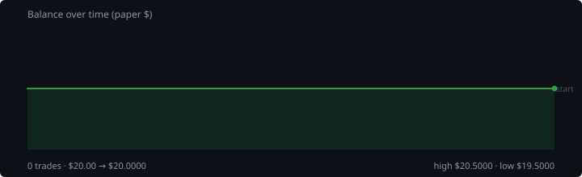

# Hourly Trading Bot

**Last updated:** 2026-08-27 19:25 UTC &nbsp;&nbsp;|&nbsp;&nbsp; updates itself every hour

Paper money only. $20 simulated, real Gate.io prices, no API keys — it cannot place a real order.

## Where the money is

| | |
|---|---|
| **Balance now** | **$20.0000** 🟢 |
| Started with | $20.0000 |
| Change | +0.00% |
| Trades finished | 0 |
| Trades open now | 0 |

## Open right now

Nothing open. The bot only enters when a coin breaks out of its 3-day range, so quiet stretches are normal.

## Last 15 finished trades

None yet.

---

### What this bot does

Watches 47 coins on the hour. Buys when one breaks above its 3-day high, sells short when one breaks below its 3-day low. Every trade gets a stop-loss, and winners are left to run on a trailing stop instead of being closed at a fixed target.

It risks 1% of the account per trade and never holds more than 5 positions on the same side, so a single bad day cannot take the account out.

**Expect it to lose more trades than it wins** — roughly 2-3 winners in 10. It is built so the winners are much bigger than the losers. Backtests on 2024-2026 lost money; this is running to see what it does on live prices, with money that isn't real.
