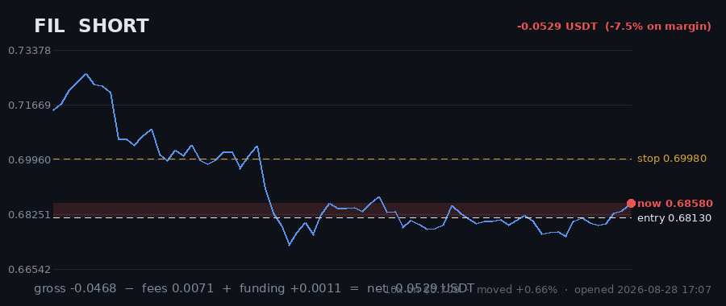
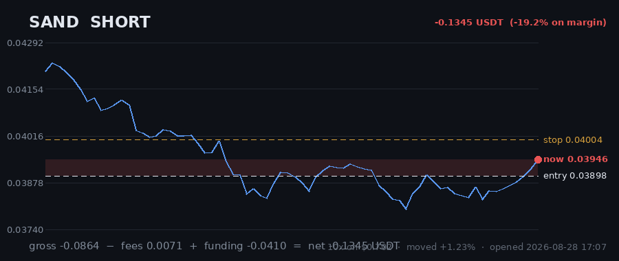
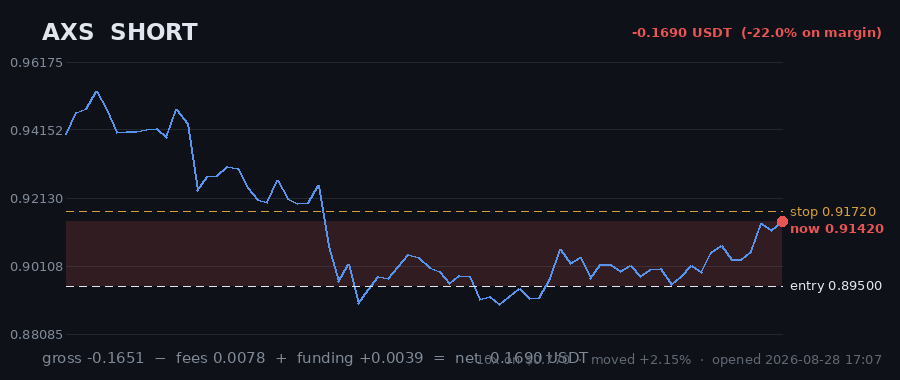
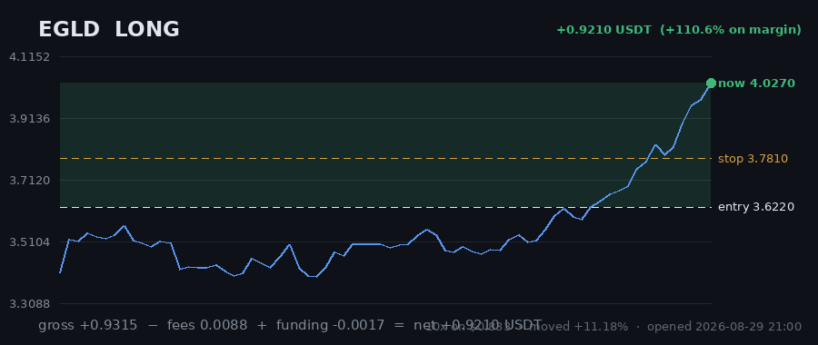
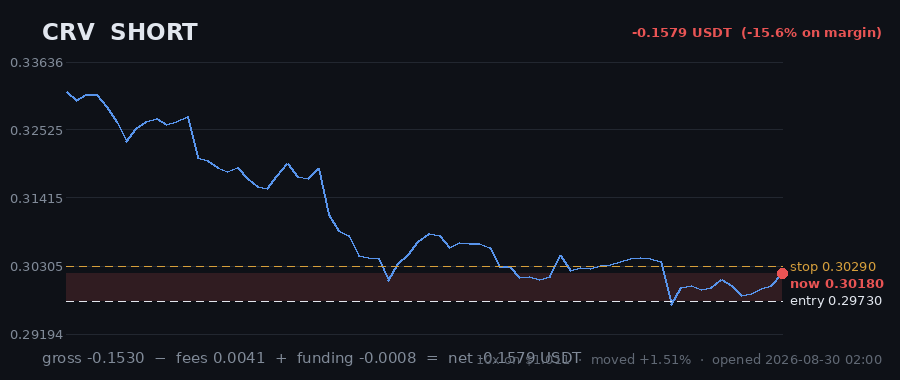
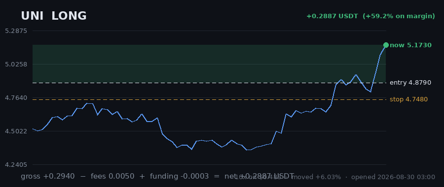
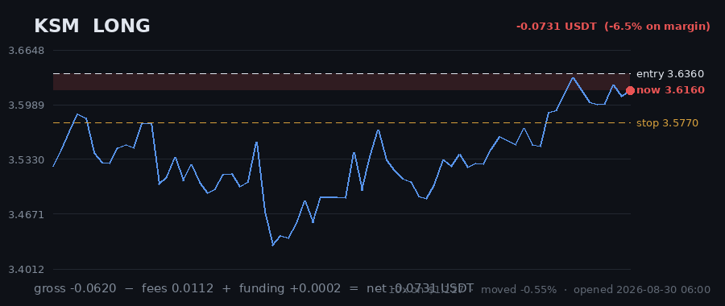

# Hourly Trading Bot

**Updated 2026-08-30 12:07 UTC** &nbsp;·&nbsp; refreshes itself every hour

Paper money. $20 simulated, real Gate.io prices, no API keys — it cannot place a real order.

## Money

| | |
|---|---|
| **Equity now** | **$19.6680** 🔴 -1.66% |
| Settled balance | $19.0456 (-4.77%) |
| Unrealised (open trades) | 🟢 +0.6224 |
| Started with | $20.0000 |
| Finished trades | 5 |
| Open now | 7 |
| Win rate | 0% (0/5) |

## Open right now

| Coin | Direction | Entry | Price now | Moved | P&L | on margin | Room to stop |
|---|---|---|---|---|---|---|---|
| **FIL** | SHORT 🔻 | 0.6813 | 0.6858 | +0.66% | 🔴 -0.0529 | -7.5% | 2.04% |
| **SAND** | SHORT 🔻 | 0.03898 | 0.03946 | +1.23% | 🔴 -0.1345 | -19.2% | 1.47% |
| **AXS** | SHORT 🔻 | 0.895 | 0.9142 | +2.15% | 🔴 -0.1690 | -22.0% | 0.33% |
| **EGLD** | LONG 🔺 | 3.622 | 4.027 | +11.18% | 🟢 +0.9210 | +110.6% | 6.11% |
| **CRV** | SHORT 🔻 | 0.2973 | 0.3018 | +1.51% | 🔴 -0.1579 | -15.6% | 0.36% |
| **UNI** | LONG 🔺 | 4.879 | 5.173 | +6.03% | 🟢 +0.2887 | +59.2% | 8.22% |
| **KSM** | LONG 🔺 | 3.636 | 3.616 | -0.55% | 🔴 -0.0731 | -6.5% | 1.08% |
| | | | | **total** | **+0.6224** | | |

> 3 long / 4 short · gross exposure **296% of equity**.

## What it is waiting for

**1 coin(s) ready to fire right now.** Scanned 47 coins.

| Coin | Would be | Needs | Status |
|---|---|---|---|
| UNI | LONG | 0.00% | **READY** |
| EGLD | LONG | 0.28% | needs 0.3% move |
| KSM | LONG | 0.89% | needs 0.9% move; volume below average |
| STORJ | SHORT | 0.90% | needs 0.9% move; volume below average |
| CRV | SHORT | 1.03% | needs 1.0% move; volume below average |
| ADA | SHORT | 1.04% | needs 1.0% move; trend too weak (ADX 16/20) |
| LRC | SHORT | 1.35% | needs 1.4% move; volume below average |
| RVN | SHORT | 1.37% | needs 1.4% move; trend too weak (ADX 15/20) |
| BCH | SHORT | 1.52% | needs 1.5% move |
| ALGO | SHORT | 1.66% | needs 1.7% move; volume below average |

A trade needs **all four** of: price breaking its 3-day range, the trend filter agreeing, enough momentum (ADX over 20), and above-average volume. A coin at 0.00% that still has not traded is being held back by one of the other three — the table says which.

## Results

### Last 15 finished trades

| Coin | Direction | Result | Why it closed | When |
|---|---|---|---|---|
| THETA | SHORT | 🔴 -0.2014 (-14.1%) | stop_loss | 2026-08-30 06:59 |
| MANA | LONG | 🔴 -0.2131 (-17.8%) | stop_loss | 2026-08-30 04:42 |
| ICP | LONG | 🔴 -0.2062 (-24.6%) | stop_loss | 2026-08-30 01:13 |
| BCH | SHORT | 🔴 -0.1922 (-19.8%) | trailing_stop_loss | 2026-08-29 20:06 |
| UNI | LONG | 🔴 -0.1416 (-30.3%) | trailing_stop_loss | 2026-08-28 10:07 |

---

### How it works

Watches 47 coins every hour. Goes long when one breaks above its 3-day high, short when one breaks below its 3-day low — but only if the trend, momentum and volume all agree.

Every trade gets a stop-loss. Winners are left to run on a trailing stop rather than closed at a fixed target. It risks 1% of the account per trade and never holds more than 5 positions on the same side, so one bad day cannot end it.

**It loses more trades than it wins** — about 2-3 winners in 10, by design, with the winners much larger. Backtested on 2024-2026 it lost money. This is running on live prices with fake money to see what it actually does.
