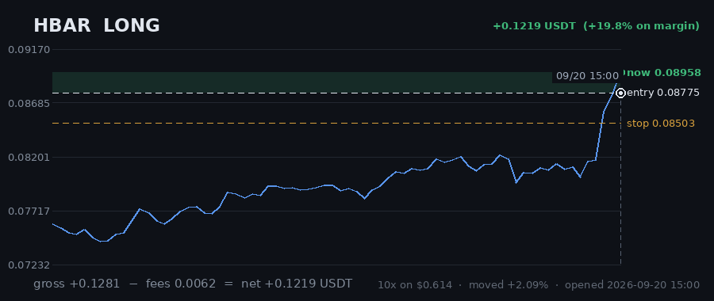

# Hourly Trading Bot

**Updated 2026-09-20 15:07 UTC** &nbsp;·&nbsp; refreshes itself every hour

Paper money. $20 simulated, real Gate.io prices, no API keys — it cannot place a real order.

## Money

| | |
|---|---|
| **Equity now** | **$21.1849** 🟢 +5.92% |
| Settled balance | $21.0630 (+5.32%) |
| Unrealised (open trades) | 🟢 +0.1219 |
| Started with | $20.0000 |
| Finished trades | 43 |
| Open now | 1 |
| Win rate | 37% (16/43) |

## Open right now

| Coin | Direction | Entry | Price now | Moved | P&L | on margin | Room to stop |
|---|---|---|---|---|---|---|---|
| **HBAR** | LONG 🔺 | 0.08775 | 0.08958 | +2.09% | 🟢 +0.1219 | +19.8% | 5.08% |
| | | | | **total** | **+0.1219** | | |

> ⚠️ **All 1 positions are long.** That is one bet on the same market direction, placed 1 times — these coins move together, so they will win together and lose together. Gross exposure is **29% of equity**.

## What it is waiting for

**1 coin(s) ready to fire right now.** Scanned 47 coins.

| Coin | Would be | Needs | Status |
|---|---|---|---|
| HBAR | LONG | 0.00% | **READY** |
| AVAX | LONG | 0.10% | needs 0.1% move |
| EGLD | SHORT | 0.17% | needs 0.2% move; volume below average |
| ALGO | LONG | 1.26% | needs 1.3% move |
| BTC | LONG | 1.58% | needs 1.6% move |
| GRT | LONG | 2.43% | needs 2.4% move; trend too weak (ADX 17/20) |
| BNB | LONG | 2.73% | needs 2.7% move; volume below average |
| ETH | LONG | 3.26% | needs 3.3% move; volume below average |
| RVN | SHORT | 3.40% | needs 3.4% move; trend too weak (ADX 19/20) |
| LTC | LONG | 3.97% | needs 4.0% move; volume below average |

A trade needs **all four** of: price breaking its 3-day range, the trend filter agreeing, enough momentum (ADX over 20), and above-average volume. A coin at 0.00% that still has not traded is being held back by one of the other three — the table says which.

## Results

### Last 15 finished trades

| Coin | Direction | Result | Why it closed | When |
|---|---|---|---|---|
| DASH | LONG | 🔴 -0.1733 (-45.7%) | stop_loss | 2026-09-19 05:58 |
| CELO | LONG | 🟢 +0.1347 (+11.6%) | force_exit | 2026-09-19 09:28 |
| ADA | LONG | 🔴 -0.0111 (-1.6%) | force_exit | 2026-09-19 09:28 |
| FIL | LONG | 🟢 +0.3452 (+56.0%) | force_exit | 2026-09-19 09:28 |
| AVAX | LONG | 🟢 +0.8187 (+99.7%) | force_exit | 2026-09-19 09:28 |
| BAND | SHORT | 🔴 -0.2433 (-17.3%) | stop_loss | 2026-09-16 21:01 |
| AAVE | SHORT | 🔴 -0.1684 (-27.9%) | trailing_stop_loss | 2026-09-17 12:58 |
| CRV | SHORT | 🔴 -0.2163 (-39.5%) | stop_loss | 2026-09-17 17:07 |
| DOT | SHORT | 🔴 -0.2029 (-30.4%) | stop_loss | 2026-09-16 12:22 |
| BTC | SHORT | 🔴 -0.1855 (-12.2%) | stop_loss | 2026-09-15 17:33 |
| ICP | SHORT | 🔴 -0.2177 (-28.4%) | stop_loss | 2026-09-17 18:20 |
| RVN | SHORT | 🔴 -0.2229 (-28.0%) | trailing_stop_loss | 2026-09-17 06:14 |
| LINK | SHORT | 🔴 -0.1837 (-16.5%) | trailing_stop_loss | 2026-09-14 02:10 |
| QTUM | LONG | 🔴 -0.2246 (-20.2%) | stop_loss | 2026-09-12 16:06 |
| BCH | SHORT | 🟢 +0.4651 (+63.3%) | force_exit | 2026-09-10 13:25 |

---

### How it works

Watches 47 coins every hour. Goes long when one breaks above its 3-day high, short when one breaks below its 3-day low — but only if the trend, momentum and volume all agree.

Every trade gets a stop-loss. Winners are left to run on a trailing stop rather than closed at a fixed target. It risks 1% of the account per trade and never holds more than 5 positions on the same side, so one bad day cannot end it.

**It loses more trades than it wins** — about 2-3 winners in 10, by design, with the winners much larger. Backtested on 2024-2026 it lost money. This is running on live prices with fake money to see what it actually does.
