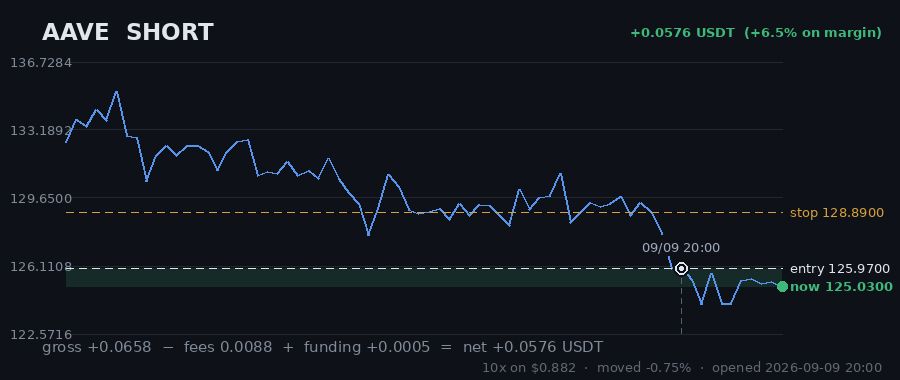

# Hourly Trading Bot

**Updated 2026-09-10 06:07 UTC** &nbsp;·&nbsp; refreshes itself every hour

Paper money. $20 simulated, real Gate.io prices, no API keys — it cannot place a real order.

## Money

| | |
|---|---|
| **Equity now** | **$21.8714** 🟢 +9.36% |
| Settled balance | $21.8139 (+9.07%) |
| Unrealised (open trades) | 🟢 +0.0576 |
| Started with | $20.0000 |
| Finished trades | 24 |
| Open now | 1 |
| Win rate | 46% (11/24) |

## Open right now

| Coin | Direction | Entry | Price now | Moved | P&L | on margin | Room to stop |
|---|---|---|---|---|---|---|---|
| **AAVE** | SHORT 🔻 | 125.97 | 125.03 | -0.75% | 🟢 +0.0576 | +6.5% | 3.09% |
| | | | | **total** | **+0.0576** | | |

> ⚠️ **All 1 positions are short.** That is one bet on the same market direction, placed 1 times — these coins move together, so they will win together and lose together. Gross exposure is **40% of equity**.

## What it is waiting for

**0 coin(s) ready to fire right now.** Scanned 47 coins.

| Coin | Would be | Needs | Status |
|---|---|---|---|
| SAND | SHORT | 1.02% | needs 1.0% move; volume below average |
| MANA | SHORT | 1.13% | needs 1.1% move; volume below average |
| BTC | SHORT | 1.15% | needs 1.1% move; volume below average |
| AAVE | SHORT | 1.36% | needs 1.4% move; volume below average |
| ETH | LONG | 1.67% | needs 1.7% move; trend too weak (ADX 19/20) |
| HBAR | SHORT | 1.87% | needs 1.9% move; volume below average |
| GALA | SHORT | 2.56% | needs 2.6% move; volume below average |
| EGLD | LONG | 2.69% | needs 2.7% move; volume below average |
| ONT | SHORT | 3.00% | needs 3.0% move |
| CHZ | LONG | 3.28% | needs 3.3% move; trend too weak (ADX 19/20) |

A trade needs **all four** of: price breaking its 3-day range, the trend filter agreeing, enough momentum (ADX over 20), and above-average volume. A coin at 0.00% that still has not traded is being held back by one of the other three — the table says which.

## Results

### Last 15 finished trades

| Coin | Direction | Result | Why it closed | When |
|---|---|---|---|---|
| ALGO | LONG | 🟢 +0.1357 (+19.3%) | force_exit | 2026-09-08 16:07 |
| ATOM | LONG | 🟢 +0.4604 (+54.2%) | force_exit | 2026-09-08 16:07 |
| ETC | LONG | 🟢 +0.3342 (+50.9%) | force_exit | 2026-09-08 16:07 |
| DOT | LONG | 🟢 +0.4297 (+100.5%) | force_exit | 2026-09-08 16:07 |
| UNI | LONG | 🔴 -0.0737 (-10.9%) | force_exit | 2026-09-05 17:25 |
| SUSHI | LONG | 🟢 +0.8701 (+120.0%) | force_exit | 2026-09-05 17:24 |
| DOT | LONG | 🟢 +0.3555 (+55.3%) | force_exit | 2026-09-06 14:09 |
| LINK | LONG | 🔴 -0.2654 (-22.0%) | stop_loss | 2026-09-04 12:30 |
| DASH | LONG | 🟢 +0.3396 (+75.4%) | force_exit | 2026-09-04 09:07 |
| EGLD | LONG | 🟢 +0.7674 (+147.5%) | trailing_stop_loss | 2026-09-03 00:18 |
| LINK | SHORT | 🔴 -0.2467 (-22.5%) | stop_loss | 2026-09-02 13:45 |
| DASH | LONG | 🔴 -0.1861 (-35.0%) | stop_loss | 2026-08-30 20:43 |
| KSM | LONG | 🔴 -0.2021 (-17.9%) | stop_loss | 2026-08-30 20:40 |
| THETA | SHORT | 🔴 -0.2014 (-14.1%) | stop_loss | 2026-08-30 06:59 |
| MANA | LONG | 🔴 -0.2131 (-17.8%) | stop_loss | 2026-08-30 04:42 |

---

### How it works

Watches 47 coins every hour. Goes long when one breaks above its 3-day high, short when one breaks below its 3-day low — but only if the trend, momentum and volume all agree.

Every trade gets a stop-loss. Winners are left to run on a trailing stop rather than closed at a fixed target. It risks 1% of the account per trade and never holds more than 5 positions on the same side, so one bad day cannot end it.

**It loses more trades than it wins** — about 2-3 winners in 10, by design, with the winners much larger. Backtested on 2024-2026 it lost money. This is running on live prices with fake money to see what it actually does.
