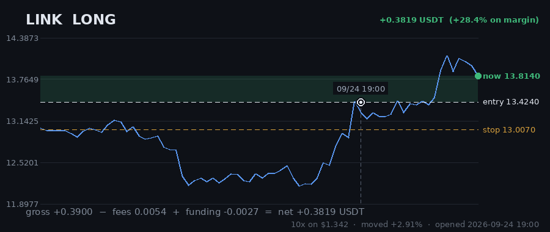
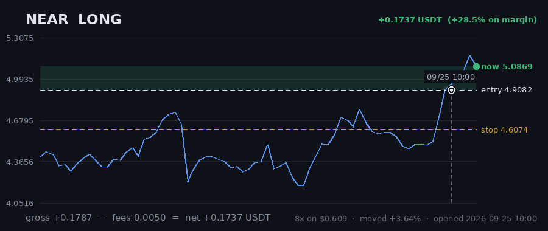

# Hourly Trading Bot

**Updated 2026-09-25 14:07 UTC** &nbsp;·&nbsp; refreshes itself every hour

Paper money. $20 simulated, real Gate.io prices, no API keys — it cannot place a real order.

## Money

| | |
|---|---|
| **Equity now** | **$20.2278** 🟢 +1.14% |
| Settled balance | $19.7996 (-1.00%) |
| Unrealised (open trades) | 🟢 +0.4281 |
| Started with | $20.0000 |
| Finished trades | 50 |
| Open now | 3 |
| Win rate | 34% (17/50) |

## Open right now

| Coin | Direction | Entry | Price now | Moved | P&L | on margin | Room to stop |
|---|---|---|---|---|---|---|---|
| **LINK** | LONG 🔺 | 13.424 | 13.814 | +2.91% | 🟢 +0.3819 | +28.4% | 5.84% |
| **MANA** | LONG 🔺 | 0.09099 | 0.08949 | -1.65% | 🔴 -0.1275 | -17.6% | 1.14% |
| **NEAR** | LONG 🔺 | 4.9082 | 5.0869 | +3.64% | 🟢 +0.1737 | +28.5% | 9.43% |
| | | | | **total** | **+0.4281** | | |

> ⚠️ **All 3 positions are long.** That is one bet on the same market direction, placed 3 times — these coins move together, so they will win together and lose together. Gross exposure is **129% of equity**.

## What it is waiting for

**0 coin(s) ready to fire right now.** Scanned 47 coins.

| Coin | Would be | Needs | Status |
|---|---|---|---|
| NEAR | LONG | 0.00% | RSI already stretched (79/78) |
| QTUM | LONG | 1.27% | needs 1.3% move |
| MANA | LONG | 1.38% | needs 1.4% move |
| KSM | LONG | 1.42% | needs 1.4% move |
| COMP | LONG | 1.67% | needs 1.7% move; volume below average |
| LINK | LONG | 1.69% | needs 1.7% move |
| ONT | LONG | 2.16% | needs 2.2% move; volume below average |
| SOL | LONG | 2.33% | needs 2.3% move |
| SKL | LONG | 2.42% | needs 2.4% move |
| ALGO | LONG | 2.58% | needs 2.6% move; volume below average |

A trade needs **all four** of: price breaking its 3-day range, the trend filter agreeing, enough momentum (ADX over 20), and above-average volume. A coin at 0.00% that still has not traded is being held back by one of the other three — the table says which.

## Results

### Last 15 finished trades

| Coin | Direction | Result | Why it closed | When |
|---|---|---|---|---|
| ALGO | LONG | 🔴 -0.1848 (-31.4%) | trailing_stop_loss | 2026-09-25 14:03 |
| LTC | LONG | 🔴 -0.3727 (-51.2%) | stop_loss | 2026-09-25 13:47 |
| NEAR | LONG | 🔴 -0.2758 (-51.5%) | stop_loss | 2026-09-23 14:13 |
| HBAR | LONG | 🔴 -0.1833 (-37.7%) | stop_loss | 2026-09-22 10:24 |
| GRT | LONG | 🟢 +0.1471 (+23.7%) | force_exit | 2026-09-21 03:14 |
| ALGO | LONG | 🔴 -0.1920 (-42.4%) | stop_loss | 2026-09-20 21:11 |
| HBAR | LONG | 🔴 -0.2020 (-32.9%) | stop_loss | 2026-09-20 19:21 |
| DASH | LONG | 🔴 -0.1733 (-45.7%) | stop_loss | 2026-09-19 05:58 |
| CELO | LONG | 🟢 +0.1347 (+11.6%) | force_exit | 2026-09-19 09:28 |
| ADA | LONG | 🔴 -0.0111 (-1.6%) | force_exit | 2026-09-19 09:28 |
| FIL | LONG | 🟢 +0.3452 (+56.0%) | force_exit | 2026-09-19 09:28 |
| AVAX | LONG | 🟢 +0.8187 (+99.7%) | force_exit | 2026-09-19 09:28 |
| BAND | SHORT | 🔴 -0.2433 (-17.3%) | stop_loss | 2026-09-16 21:01 |
| AAVE | SHORT | 🔴 -0.1684 (-27.9%) | trailing_stop_loss | 2026-09-17 12:58 |
| CRV | SHORT | 🔴 -0.2163 (-39.5%) | stop_loss | 2026-09-17 17:07 |

---

### How it works

Watches 47 coins every hour. Goes long when one breaks above its 3-day high, short when one breaks below its 3-day low — but only if the trend, momentum and volume all agree.

Every trade gets a stop-loss. Winners are left to run on a trailing stop rather than closed at a fixed target. It risks 1% of the account per trade and never holds more than 5 positions on the same side, so one bad day cannot end it.

**It loses more trades than it wins** — about 2-3 winners in 10, by design, with the winners much larger. Backtested on 2024-2026 it lost money. This is running on live prices with fake money to see what it actually does.
