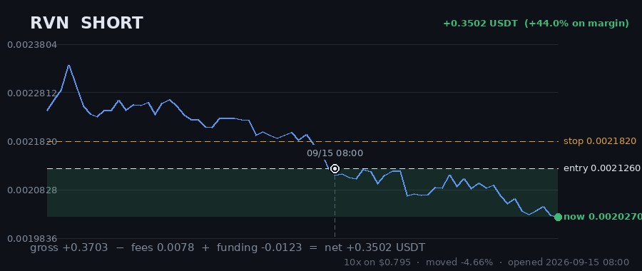
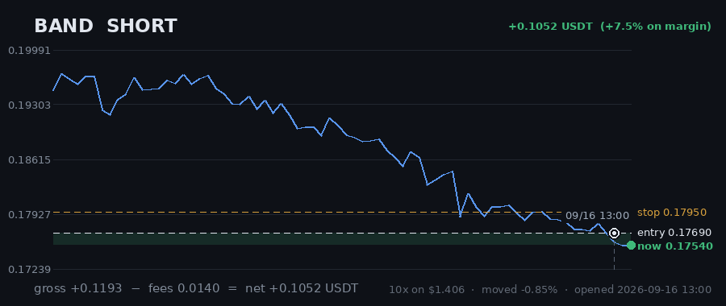

# Hourly Trading Bot

**Updated 2026-09-16 15:07 UTC** &nbsp;·&nbsp; refreshes itself every hour

Paper money. $20 simulated, real Gate.io prices, no API keys — it cannot place a real order.

## Money

| | |
|---|---|
| **Equity now** | **$22.2908** 🟢 +11.45% |
| Settled balance | $21.0174 (+5.09%) |
| Unrealised (open trades) | 🟢 +1.2734 |
| Started with | $20.0000 |
| Finished trades | 33 |
| Open now | 5 |
| Win rate | 39% (13/33) |

## Open right now

| Coin | Direction | Entry | Price now | Moved | P&L | on margin | Room to stop |
|---|---|---|---|---|---|---|---|
| **RVN** | SHORT 🔻 | 0.002126 | 0.002027 | -4.66% | 🟢 +0.3502 | +44.0% | 7.65% |
| **ICP** | SHORT 🔻 | 2.557 | 2.464 | -3.64% | 🟢 +0.2708 | +35.3% | 6.62% |
| **CRV** | SHORT 🔻 | 0.3239 | 0.3051 | -5.80% | 🟢 +0.3150 | +57.5% | 10.19% |
| **AAVE** | SHORT 🔻 | 120.91 | 116.16 | -3.93% | 🟢 +0.2322 | +38.4% | 7.20% |
| **BAND** | SHORT 🔻 | 0.1769 | 0.1754 | -0.85% | 🟢 +0.1052 | +7.5% | 2.34% |
| | | | | **total** | **+1.2734** | | |

> ⚠️ **All 5 positions are short.** That is one bet on the same market direction, placed 5 times — these coins move together, so they will win together and lose together. Gross exposure is **196% of equity**.

## What it is waiting for

**11 coin(s) ready to fire right now.** Scanned 47 coins.

| Coin | Would be | Needs | Status |
|---|---|---|---|
| ADA | SHORT | 0.00% | **READY** |
| LINK | SHORT | 0.00% | **READY** |
| LTC | SHORT | 0.00% | **READY** |
| ALGO | SHORT | 0.00% | volume below average |
| HBAR | SHORT | 0.00% | **READY** |
| AXS | SHORT | 0.00% | **READY** |
| THETA | SHORT | 0.00% | **READY** |
| AAVE | SHORT | 0.00% | volume below average |
| CHZ | SHORT | 0.00% | volume below average |
| ENJ | SHORT | 0.00% | **READY** |

A trade needs **all four** of: price breaking its 3-day range, the trend filter agreeing, enough momentum (ADX over 20), and above-average volume. A coin at 0.00% that still has not traded is being held back by one of the other three — the table says which.

## Results

### Last 15 finished trades

| Coin | Direction | Result | Why it closed | When |
|---|---|---|---|---|
| DOT | SHORT | 🔴 -0.2029 (-30.4%) | stop_loss | 2026-09-16 12:22 |
| BTC | SHORT | 🔴 -0.1855 (-12.2%) | stop_loss | 2026-09-15 17:33 |
| LINK | SHORT | 🔴 -0.1837 (-16.5%) | trailing_stop_loss | 2026-09-14 02:10 |
| QTUM | LONG | 🔴 -0.2246 (-20.2%) | stop_loss | 2026-09-12 16:06 |
| BCH | SHORT | 🟢 +0.4651 (+63.3%) | force_exit | 2026-09-10 13:25 |
| MANA | SHORT | 🔴 -0.2237 (-22.1%) | trailing_stop_loss | 2026-09-11 12:37 |
| EGLD | LONG | 🔴 -0.2262 (-42.6%) | stop_loss | 2026-09-10 11:05 |
| CRV | SHORT | 🔴 -0.2182 (-34.4%) | trailing_stop_loss | 2026-09-10 14:26 |
| AAVE | SHORT | 🟢 +0.2033 (+23.1%) | force_exit | 2026-09-10 11:07 |
| ALGO | LONG | 🟢 +0.1357 (+19.3%) | force_exit | 2026-09-08 16:07 |
| ATOM | LONG | 🟢 +0.4604 (+54.2%) | force_exit | 2026-09-08 16:07 |
| ETC | LONG | 🟢 +0.3342 (+50.9%) | force_exit | 2026-09-08 16:07 |
| DOT | LONG | 🟢 +0.4297 (+100.5%) | force_exit | 2026-09-08 16:07 |
| UNI | LONG | 🔴 -0.0737 (-10.9%) | force_exit | 2026-09-05 17:25 |
| SUSHI | LONG | 🟢 +0.8701 (+120.0%) | force_exit | 2026-09-05 17:24 |

---

### How it works

Watches 47 coins every hour. Goes long when one breaks above its 3-day high, short when one breaks below its 3-day low — but only if the trend, momentum and volume all agree.

Every trade gets a stop-loss. Winners are left to run on a trailing stop rather than closed at a fixed target. It risks 1% of the account per trade and never holds more than 5 positions on the same side, so one bad day cannot end it.

**It loses more trades than it wins** — about 2-3 winners in 10, by design, with the winners much larger. Backtested on 2024-2026 it lost money. This is running on live prices with fake money to see what it actually does.
