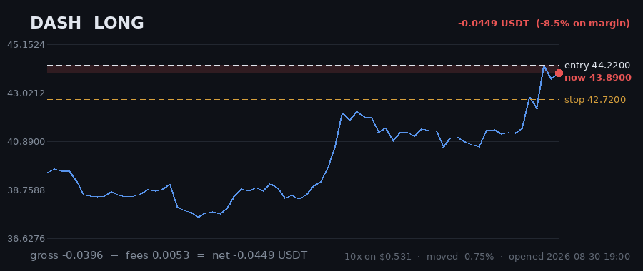

# Hourly Trading Bot

**Updated 2026-08-30 20:07 UTC** &nbsp;·&nbsp; refreshes itself every hour

Paper money. $20 simulated, real Gate.io prices, no API keys — it cannot place a real order.

## Money

| | |
|---|---|
| **Equity now** | **$19.2653** 🔴 -3.67% |
| Settled balance | $19.0347 (-4.83%) |
| Unrealised (open trades) | 🟢 +0.2307 |
| Started with | $20.0000 |
| Finished trades | 8 |
| Open now | 5 |
| Win rate | 12% (1/8) |

## Open right now

| Coin | Direction | Entry | Price now | Moved | P&L | on margin | Room to stop |
|---|---|---|---|---|---|---|---|
| **FIL** | SHORT 🔻 | 0.6813 | 0.6898 | +1.25% | 🔴 -0.0944 | -13.3% | 1.45% |
| **SAND** | SHORT 🔻 | 0.03898 | 0.0387 | -0.72% | 🔴 -0.0016 | -0.2% | 3.46% |
| **UNI** | LONG 🔺 | 4.879 | 5.353 | +9.72% | 🟢 +0.4683 | +96.0% | 5.51% |
| **KSM** | LONG 🔺 | 3.636 | 3.608 | -0.77% | 🔴 -0.0967 | -8.6% | 0.86% |
| **DASH** | LONG 🔺 | 44.22 | 43.89 | -0.75% | 🔴 -0.0449 | -8.5% | 2.67% |
| | | | | **total** | **+0.2307** | | |

> 3 long / 2 short · gross exposure **187% of equity**.

## What it is waiting for

**0 coin(s) ready to fire right now.** Scanned 47 coins.

| Coin | Would be | Needs | Status |
|---|---|---|---|
| STORJ | SHORT | 0.37% | needs 0.4% move; volume below average |
| KSM | LONG | 0.91% | needs 0.9% move; volume below average |
| RVN | SHORT | 1.04% | needs 1.0% move; trend too weak (ADX 14/20) |
| ETH | LONG | 1.26% | needs 1.3% move; volume below average |
| SNX | SHORT | 1.29% | needs 1.3% move; volume below average |
| ENJ | SHORT | 1.87% | needs 1.9% move; trend too weak (ADX 16/20) |
| GALA | SHORT | 1.89% | needs 1.9% move; trend too weak (ADX 9/20) |
| ANKR | LONG | 1.98% | needs 2.0% move; trend too weak (ADX 10/20) |
| ADA | SHORT | 2.02% | needs 2.0% move |
| DASH | LONG | 2.09% | needs 2.1% move; volume below average |

A trade needs **all four** of: price breaking its 3-day range, the trend filter agreeing, enough momentum (ADX over 20), and above-average volume. A coin at 0.00% that still has not traded is being held back by one of the other three — the table says which.

## Results

### Last 15 finished trades

| Coin | Direction | Result | Why it closed | When |
|---|---|---|---|---|
| THETA | SHORT | 🔴 -0.2014 (-14.1%) | stop_loss | 2026-08-30 06:59 |
| MANA | LONG | 🔴 -0.2131 (-17.8%) | stop_loss | 2026-08-30 04:42 |
| CRV | SHORT | 🔴 -0.1984 (-19.6%) | stop_loss | 2026-08-30 12:09 |
| EGLD | LONG | 🟢 +0.3823 (+45.9%) | trailing_stop_loss | 2026-08-30 17:24 |
| ICP | LONG | 🔴 -0.2062 (-24.6%) | stop_loss | 2026-08-30 01:13 |
| BCH | SHORT | 🔴 -0.1922 (-19.8%) | trailing_stop_loss | 2026-08-29 20:06 |
| AXS | SHORT | 🔴 -0.1948 (-25.3%) | trailing_stop_loss | 2026-08-30 12:07 |
| UNI | LONG | 🔴 -0.1416 (-30.3%) | trailing_stop_loss | 2026-08-28 10:07 |

---

### How it works

Watches 47 coins every hour. Goes long when one breaks above its 3-day high, short when one breaks below its 3-day low — but only if the trend, momentum and volume all agree.

Every trade gets a stop-loss. Winners are left to run on a trailing stop rather than closed at a fixed target. It risks 1% of the account per trade and never holds more than 5 positions on the same side, so one bad day cannot end it.

**It loses more trades than it wins** — about 2-3 winners in 10, by design, with the winners much larger. Backtested on 2024-2026 it lost money. This is running on live prices with fake money to see what it actually does.
