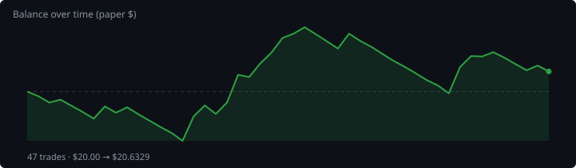
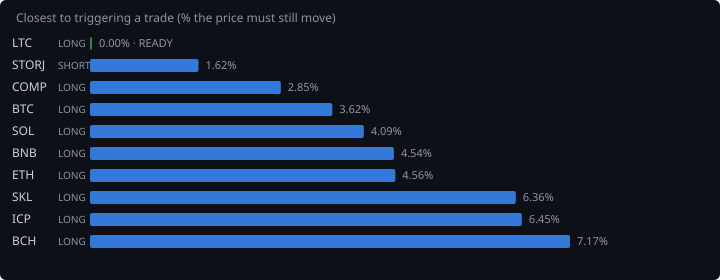
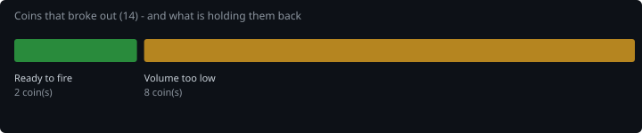
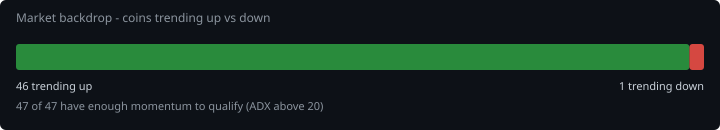
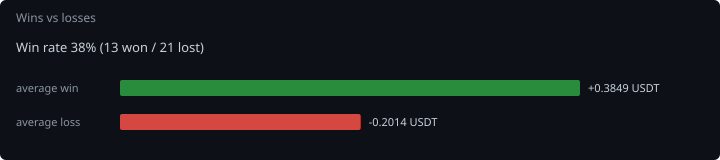

# Hourly Trading Bot

**Updated 2026-09-03 12:07 UTC** &nbsp;·&nbsp; refreshes itself every hour

Paper money. $20 simulated, real Gate.io prices, no API keys — it cannot place a real order.

## Money

| | |
|---|---|
| **Equity now** | **$19.2279** 🔴 -3.86% |
| Settled balance | $19.2279 (-3.86%) |
| Started with | $20.0000 |
| Finished trades | 15 |
| Open now | 0 |
| Win rate | 27% (4/15) |

## Open right now

Nothing open.

## What it is waiting for

**0 coin(s) ready to fire right now.** Scanned 47 coins.

| Coin | Would be | Needs | Status |
|---|---|---|---|
| BNB | LONG | 0.00% | RSI already stretched (82/78) |
| LTC | LONG | 0.02% | needs 0.0% move; volume below average |
| BAT | SHORT | 1.00% | needs 1.0% move; trend too weak (ADX 17/20) |
| MANA | LONG | 1.53% | needs 1.5% move; trend too weak (ADX 11/20) |
| BTC | LONG | 1.70% | needs 1.7% move; trend too weak (ADX 14/20) |
| THETA | SHORT | 1.72% | needs 1.7% move; trend too weak (ADX 10/20) |
| DOT | LONG | 1.82% | needs 1.8% move; trend too weak (ADX 14/20) |
| SKL | SHORT | 1.91% | needs 1.9% move; volume below average |
| ETH | SHORT | 2.10% | needs 2.1% move; volume below average |
| QTUM | SHORT | 2.50% | needs 2.5% move; trend too weak (ADX 13/20) |

A trade needs **all four** of: price breaking its 3-day range, the trend filter agreeing, enough momentum (ADX over 20), and above-average volume. A coin at 0.00% that still has not traded is being held back by one of the other three — the table says which.

## Results

### Last 15 finished trades

| Coin | Direction | Result | Why it closed | When |
|---|---|---|---|---|
| EGLD | LONG | 🟢 +0.7674 (+147.5%) | trailing_stop_loss | 2026-09-03 00:18 |
| LINK | SHORT | 🔴 -0.2467 (-22.5%) | stop_loss | 2026-09-02 13:45 |
| DASH | LONG | 🔴 -0.1861 (-35.0%) | stop_loss | 2026-08-30 20:43 |
| KSM | LONG | 🔴 -0.2021 (-17.9%) | stop_loss | 2026-08-30 20:40 |
| THETA | SHORT | 🔴 -0.2014 (-14.1%) | stop_loss | 2026-08-30 06:59 |
| MANA | LONG | 🔴 -0.2131 (-17.8%) | stop_loss | 2026-08-30 04:42 |
| UNI | LONG | 🟢 +0.1705 (+34.9%) | trailing_stop_loss | 2026-08-30 23:46 |
| CRV | SHORT | 🔴 -0.1984 (-19.6%) | stop_loss | 2026-08-30 12:09 |
| EGLD | LONG | 🟢 +0.3823 (+45.9%) | trailing_stop_loss | 2026-08-30 17:24 |
| ICP | LONG | 🔴 -0.2062 (-24.6%) | stop_loss | 2026-08-30 01:13 |
| BCH | SHORT | 🔴 -0.1922 (-19.8%) | trailing_stop_loss | 2026-08-29 20:06 |
| AXS | SHORT | 🔴 -0.1948 (-25.3%) | trailing_stop_loss | 2026-08-30 12:07 |
| SAND | SHORT | 🟢 +0.0906 (+12.9%) | force_exit | 2026-08-31 18:07 |
| FIL | SHORT | 🔴 -0.2003 (-28.3%) | trailing_stop_loss | 2026-09-01 07:08 |
| UNI | LONG | 🔴 -0.1416 (-30.3%) | trailing_stop_loss | 2026-08-28 10:07 |

---

### How it works

Watches 47 coins every hour. Goes long when one breaks above its 3-day high, short when one breaks below its 3-day low — but only if the trend, momentum and volume all agree.

Every trade gets a stop-loss. Winners are left to run on a trailing stop rather than closed at a fixed target. It risks 1% of the account per trade and never holds more than 5 positions on the same side, so one bad day cannot end it.

**It loses more trades than it wins** — about 2-3 winners in 10, by design, with the winners much larger. Backtested on 2024-2026 it lost money. This is running on live prices with fake money to see what it actually does.
