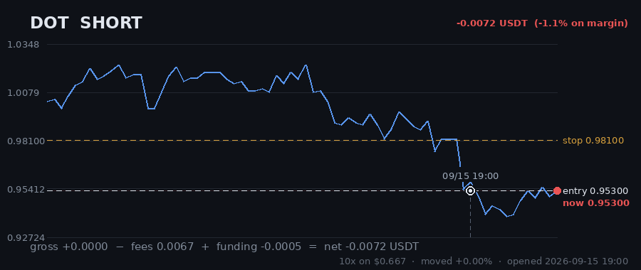
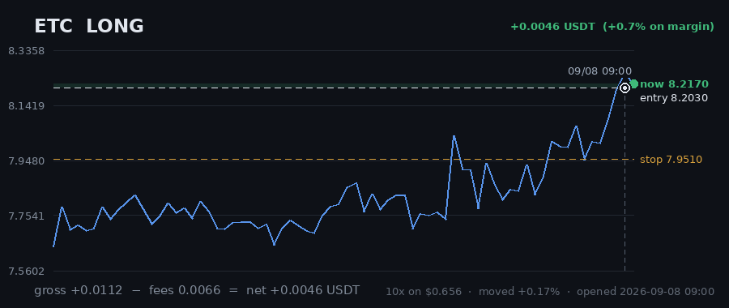

# Hourly Trading Bot

**Updated 2026-09-08 10:10 UTC** &nbsp;·&nbsp; refreshes itself every hour

Paper money. $20 simulated, real Gate.io prices, no API keys — it cannot place a real order.

## Money

| | |
|---|---|
| **Equity now** | **$20.5329** 🟢 +2.66% |
| Settled balance | $20.4539 (+2.27%) |
| Unrealised (open trades) | 🟢 +0.0790 |
| Started with | $20.0000 |
| Finished trades | 20 |
| Open now | 2 |
| Win rate | 35% (7/20) |

## Open right now

| Coin | Direction | Entry | Price now | Moved | P&L | on margin | Room to stop |
|---|---|---|---|---|---|---|---|
| **DOT** | LONG 🔺 | 1.069 | 1.089 | +1.87% | 🟢 +0.0744 | +17.4% | 5.51% |
| **ETC** | LONG 🔺 | 8.203 | 8.217 | +0.17% | 🟢 +0.0046 | +0.7% | 3.24% |
| | | | | **total** | **+0.0790** | | |

> ⚠️ **All 2 positions are long.** That is one bet on the same market direction, placed 2 times — these coins move together, so they will win together and lose together. Gross exposure is **53% of equity**.

## What it is waiting for

**1 coin(s) ready to fire right now.** Scanned 47 coins.

| Coin | Would be | Needs | Status |
|---|---|---|---|
| ETC | LONG | 0.00% | **READY** |
| COMP | LONG | 0.14% | needs 0.1% move; trend too weak (ADX 13/20) |
| QTUM | LONG | 0.29% | needs 0.3% move; trend too weak (ADX 13/20) |
| BAND | LONG | 0.41% | needs 0.4% move; trend too weak (ADX 16/20) |
| APE | LONG | 0.43% | needs 0.4% move; trend too weak (ADX 10/20) |
| SAND | LONG | 0.56% | needs 0.6% move; trend too weak (ADX 9/20) |
| CHZ | LONG | 0.77% | needs 0.8% move; trend too weak (ADX 13/20) |
| SKL | LONG | 0.77% | needs 0.8% move; volume below average |
| ICP | LONG | 0.94% | needs 0.9% move; volume below average |
| IOTA | LONG | 1.00% | needs 1.0% move; trend too weak (ADX 11/20) |

A trade needs **all four** of: price breaking its 3-day range, the trend filter agreeing, enough momentum (ADX over 20), and above-average volume. A coin at 0.00% that still has not traded is being held back by one of the other three — the table says which.

## Results

### Last 15 finished trades

| Coin | Direction | Result | Why it closed | When |
|---|---|---|---|---|
| UNI | LONG | 🔴 -0.0737 (-10.9%) | force_exit | 2026-09-05 17:25 |
| SUSHI | LONG | 🟢 +0.8701 (+120.0%) | force_exit | 2026-09-05 17:24 |
| DOT | LONG | 🟢 +0.3555 (+55.3%) | force_exit | 2026-09-06 14:09 |
| LINK | LONG | 🔴 -0.2654 (-22.0%) | stop_loss | 2026-09-04 12:30 |
| DASH | LONG | 🟢 +0.3396 (+75.4%) | force_exit | 2026-09-04 09:07 |
| EGLD | LONG | 🟢 +0.7674 (+147.5%) | trailing_stop_loss | 2026-09-03 00:18 |
| LINK | SHORT | 🔴 -0.2467 (-22.5%) | stop_loss | 2026-09-02 13:45 |
| DASH | LONG | 🔴 -0.1861 (-35.0%) | stop_loss | 2026-08-30 20:43 |
| KSM | LONG | 🔴 -0.2021 (-17.9%) | stop_loss | 2026-08-30 20:40 |
| THETA | SHORT | 🔴 -0.2014 (-14.1%) | stop_loss | 2026-08-30 06:59 |
| MANA | LONG | 🔴 -0.2131 (-17.8%) | stop_loss | 2026-08-30 04:42 |
| UNI | LONG | 🟢 +0.1705 (+34.9%) | trailing_stop_loss | 2026-08-30 23:46 |
| CRV | SHORT | 🔴 -0.1984 (-19.6%) | stop_loss | 2026-08-30 12:09 |
| EGLD | LONG | 🟢 +0.3823 (+45.9%) | trailing_stop_loss | 2026-08-30 17:24 |
| ICP | LONG | 🔴 -0.2062 (-24.6%) | stop_loss | 2026-08-30 01:13 |

---

### How it works

Watches 47 coins every hour. Goes long when one breaks above its 3-day high, short when one breaks below its 3-day low — but only if the trend, momentum and volume all agree.

Every trade gets a stop-loss. Winners are left to run on a trailing stop rather than closed at a fixed target. It risks 1% of the account per trade and never holds more than 5 positions on the same side, so one bad day cannot end it.

**It loses more trades than it wins** — about 2-3 winners in 10, by design, with the winners much larger. Backtested on 2024-2026 it lost money. This is running on live prices with fake money to see what it actually does.
