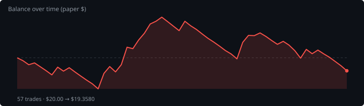
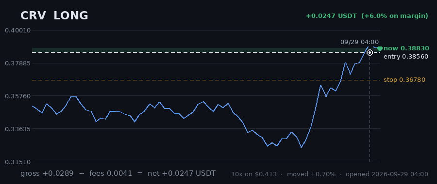
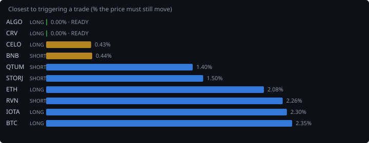
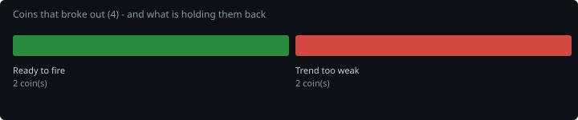
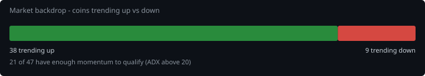
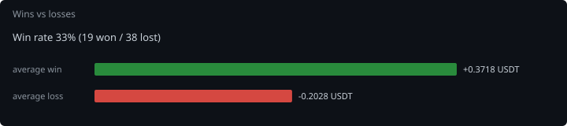

# Hourly Trading Bot

**Updated 2026-09-30 08:07 UTC** &nbsp;·&nbsp; refreshes itself every hour

Paper money. $20 simulated, real Gate.io prices, no API keys — it cannot place a real order.

## Money

| | |
|---|---|
| **Equity now** | **$19.2329** 🔴 -3.84% |
| Settled balance | $19.1917 (-4.04%) |
| Unrealised (open trades) | 🟢 +0.0413 |
| Started with | $20.0000 |
| Finished trades | 58 |
| Open now | 1 |
| Win rate | 33% (19/58) |

## Open right now

| Coin | Direction | Entry | Price now | Moved | P&L | on margin | Room to stop |
|---|---|---|---|---|---|---|---|
| **CRV** | LONG 🔺 | 0.3856 | 0.39 | +1.14% | 🟢 +0.0413 | +10.0% | 5.69% |
| | | | | **total** | **+0.0413** | | |

> ⚠️ **All 1 positions are long.** That is one bet on the same market direction, placed 1 times — these coins move together, so they will win together and lose together. Gross exposure is **22% of equity**.

## What it is waiting for

**0 coin(s) ready to fire right now.** Scanned 47 coins.

| Coin | Would be | Needs | Status |
|---|---|---|---|
| ANKR | SHORT | 0.99% | needs 1.0% move; trend too weak (ADX 14/20) |
| BNB | SHORT | 1.19% | needs 1.2% move; trend too weak (ADX 13/20) |
| AXS | LONG | 1.68% | needs 1.7% move; trend too weak (ADX 16/20) |
| BCH | SHORT | 1.81% | needs 1.8% move; volume below average |
| STORJ | SHORT | 2.18% | needs 2.2% move; trend too weak (ADX 17/20) |
| ATOM | SHORT | 2.21% | needs 2.2% move; trend too weak (ADX 11/20) |
| BTC | LONG | 2.24% | needs 2.2% move; trend too weak (ADX 14/20) |
| DOGE | SHORT | 2.42% | needs 2.4% move; trend too weak (ADX 14/20) |
| ETH | LONG | 2.81% | needs 2.8% move; trend too weak (ADX 13/20) |
| DASH | SHORT | 2.95% | needs 2.9% move; volume below average |

A trade needs **all four** of: price breaking its 3-day range, the trend filter agreeing, enough momentum (ADX over 20), and above-average volume. A coin at 0.00% that still has not traded is being held back by one of the other three — the table says which.

## Results

### Last 15 finished trades

| Coin | Direction | Result | Why it closed | When |
|---|---|---|---|---|
| ALGO | LONG | 🔴 -0.1663 (-51.0%) | stop_loss | 2026-09-29 07:08 |
| NEAR | LONG | 🔴 -0.2461 (-44.3%) | stop_loss | 2026-09-28 00:36 |
| SAND | LONG | 🔴 -0.2134 (-27.8%) | stop_loss | 2026-09-26 20:04 |
| ICP | LONG | 🔴 -0.2077 (-32.8%) | stop_loss | 2026-09-26 18:45 |
| DOT | LONG | 🔴 -0.1731 (-33.7%) | stop_loss | 2026-09-26 19:19 |
| ALGO | LONG | 🔴 -0.1848 (-31.4%) | trailing_stop_loss | 2026-09-25 14:03 |
| NEAR | LONG | 🟢 +0.1803 (+29.6%) | force_exit | 2026-09-25 15:27 |
| MANA | LONG | 🔴 -0.2154 (-29.7%) | stop_loss | 2026-09-28 03:33 |
| LINK | LONG | 🟢 +0.4337 (+32.3%) | force_exit | 2026-09-25 15:27 |
| LTC | LONG | 🔴 -0.3727 (-51.2%) | stop_loss | 2026-09-25 13:47 |
| NEAR | LONG | 🔴 -0.2758 (-51.5%) | stop_loss | 2026-09-23 14:13 |
| HBAR | LONG | 🔴 -0.1833 (-37.7%) | stop_loss | 2026-09-22 10:24 |
| GRT | LONG | 🟢 +0.1471 (+23.7%) | force_exit | 2026-09-21 03:14 |
| ALGO | LONG | 🔴 -0.1920 (-42.4%) | stop_loss | 2026-09-20 21:11 |
| HBAR | LONG | 🔴 -0.2020 (-32.9%) | stop_loss | 2026-09-20 19:21 |

---

### How it works

Watches 47 coins every hour. Goes long when one breaks above its 3-day high, short when one breaks below its 3-day low — but only if the trend, momentum and volume all agree.

Every trade gets a stop-loss. Winners are left to run on a trailing stop rather than closed at a fixed target. It risks 1% of the account per trade and never holds more than 5 positions on the same side, so one bad day cannot end it.

**It loses more trades than it wins** — about 2-3 winners in 10, by design, with the winners much larger. Backtested on 2024-2026 it lost money. This is running on live prices with fake money to see what it actually does.
